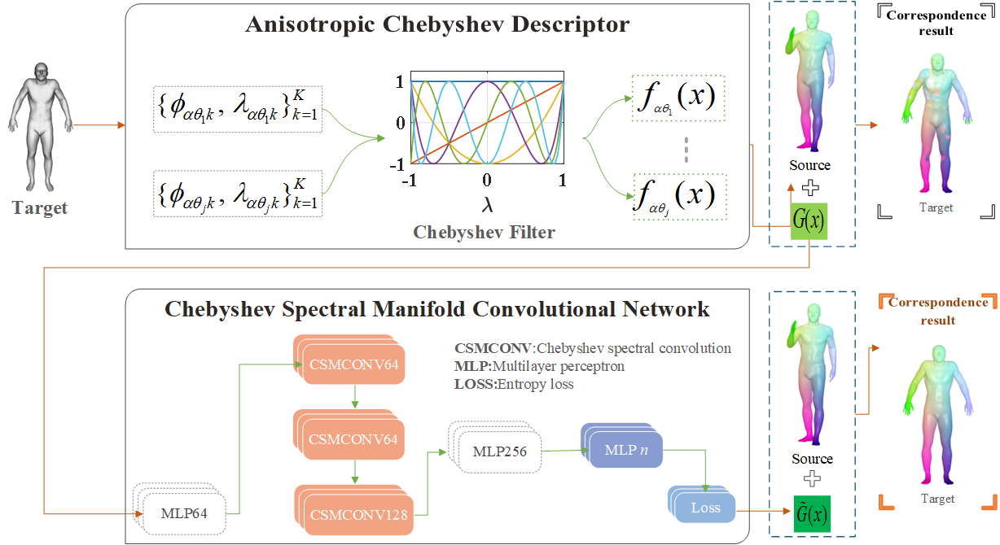

# An Anisotropic Chebyshev Descriptor and its Optimization for Deformable Shape Correspondence

---

This is the code for the paper 'An Anisotropic Chebyshev Descriptor and its Optimization for Deformable Shape Correspondence' by Shengjun Liu, Hongyan Liu, Wang Chen, Dong-Ming Yan, Ling Hu, Xinru Liu, Qinsong Li accepted by Computational Visual Media (CVM).



The main contributions of this paper are firstly, a new descriptor, called the anisotropic Chebyshev descriptor (ACD). It captures features from different directions on a surface, and it is better than similar descriptors in terms of computational efficiency and discriminative ability.
Secondly, we further improve the ACD's by constructing a Chebyshev spectral manifold convolutional neural network (CSMCNN) in the spectral domain. It has better robustness to surface discretization than  current state-of-the-art networks. Our experimental results show that the learned descriptor obtained by combining the ACD and the CSMCNN is superior to others in terms of discriminative ability and robustness.

# How to use this code

## Anisotropic Chebyshev Descriptor

We have provided two core functions:

run_compute_ACD.m

## Chebyshev spectral manifold convolutional neural network

### Environment
```bash	
	conda create -n CSMCNN python=3.8     # (options: 3.X)
	source activate CSMCNN                # (create and activate new environment if you use Anaconda)
	
	conda install pytorch=1.9.0 torchvision cudatoolkit=11.1 -c pytorch     # (options: 10.X)
	pip install torch-scatter==latest+cu111 -f https://pytorch-geometric.com/whl/torch-1.9.0.html
	pip install torch-sparse==latest+cu111 -f https://pytorch-geometric.com/whl/torch-1.9.0.html
	pip install torch-cluster==latest+cu111 -f https://pytorch-geometric.com/whl/torch-1.9.0.html
	pip install torch-geometric
```

### Usage

1. Put models in the folder ./CSMCNN/datasets/FAUST/shapes/ for FAUST dataset or ./CSMCNN/datasets/SCAPE/shapes/ for SCAPE dataset
2. generate Anisotropic Chebyshev Descriptor (ACD) descriptors using ./ACD/run_compute_ACD.m and put them into the folder ./CSMCNN/datasets/FAUST/ACD/ or ./CSMCNN/datasets/SCAPE/ACD/.
3. generate evals and evecs using ./data_precompute/compute_evecs.m and put them into the folder ./CSMCNN/datasets/FAUST/evecs/ or ./CSMCNN/datasets/SCAPE/evecs/.
4. Training examples

```bash
    # for FAUST
    python CSMCNN_FAUST.py
    # for SCAPE
    python CSMCNN_SCAPE.py
```

5. Dense correspondence can be obtained by directly computing the nearest-neighbor using the L2 distance in descriptor space.

## Other dataset

FAUST 10K,15K [yiqun-wang/LPS-data: Datasets with incompatible shape structure (github.com)](https://github.com/yiqun-wang/LPS-data)


If you have any questions, please contact me. [chenwang_99@163.com](mailto:qinsli.cg@foxmail.com) (Wang Chen)


